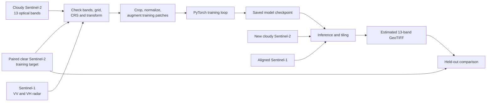
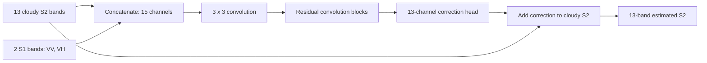
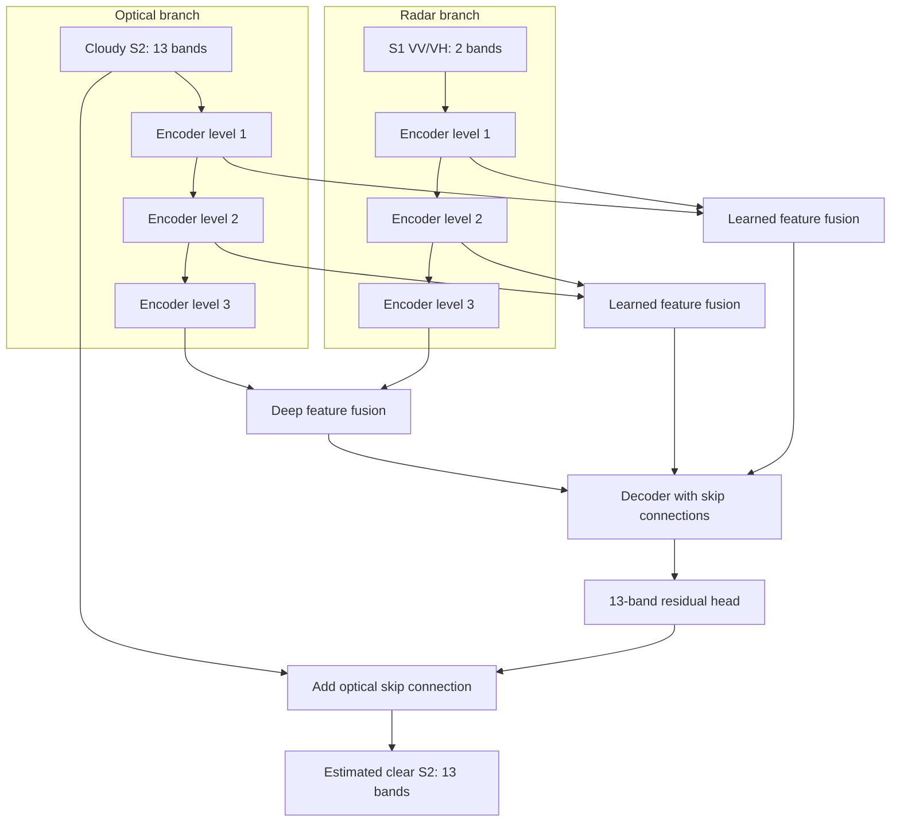

# ClearSky-AI beginner guide

This guide explains the project from the problem and satellite data up through the application, model training, evaluation, and future work. It is written for someone who is new to machine learning and remote sensing.

## 1. Read this first: current code and planned work

The repository already contains a working Sentinel-1/Sentinel-2 demo, a PyTorch training entry point, evaluation and data-preparation scripts, and a separate LISS-IV research prototype. The current Sentinel demo uses a published pretrained checkpoint. The training entry point can create a new checkpoint from random initialization, but its current network follows the residual design in the cited research paper.

The proposed synopsis describes a next-stage model with separate Sentinel-2 and Sentinel-1 encoders and learned multiscale fusion. That custom architecture is a design proposal; it is not yet the network currently loaded by the demo. Keep those states distinct when presenting results. A locally trained checkpoint means the weights were optimized in this project; it does not by itself mean that the architecture is new.

| Track | What it does | State in this repository |
| --- | --- | --- |
| Sentinel demo | Uses cloudy Sentinel-2 and aligned Sentinel-1 VV/VH to estimate a 13-band optical image | Runnable with the included published checkpoint |
| Sentinel training | Trains the repository's current residual network from random initialization or a compatible starting checkpoint | Training code exists; a full SEN12MS-CR download is needed for substantial training |
| Custom proposal model | Uses two modality-specific encoders, multiscale fusion, a decoder, and a 13-band output head | Proposed design; implementation and training remain future work |
| LISS-IV | Separate three-band Indian remote-sensing research prototype | Historical experiments and a demo are preserved; broad real-cloud validation is still needed |

## 2. What problem are we solving?

Optical satellite sensors measure reflected sunlight in several wavelength bands. Clouds can cover the ground and hide the surface signal. Sentinel-2 provides multispectral optical observations, including visible, near-infrared, and shortwave-infrared bands. A model cannot directly see the ground through a thick cloud; it can only estimate a plausible clear-looking value from learned patterns and other observations.

Sentinel-1 is a radar satellite. Its VV and VH channels measure radar backscatter and work in cloudy conditions. Radar responds differently from optical imagery, so it can provide useful structural clues, but it is not a direct replacement for a missing optical measurement.

The project pairs a cloudy Sentinel-2 image with a spatially aligned Sentinel-1 image and predicts an estimated clear Sentinel-2 image. When available, a paired clear image is used as the training target or evaluation reference. The result must be described as a reconstruction estimate, not as a newly observed cloud-free image.

### Essential terms

- **Band:** One measured wavelength range (optical) or radar polarization (SAR) stored as a 2D image.
- **Pixel grid:** The rows, columns, and geographic placement shared by raster bands.
- **Co-registration:** Aligning images so that the same pixel location represents the same ground location in every image.
- **CRS:** Coordinate reference system that defines how pixel locations map to the Earth.
- **GeoTIFF:** A raster image file that can also store CRS, pixel size, and geographic transform information.
- **Patch:** A smaller crop cut from a large satellite scene so it fits into model memory.
- **Checkpoint:** A saved collection of model weights, and sometimes optimizer state and training settings.
- **Data leakage:** Accidentally putting nearby or overlapping crops from one scene in both training and evaluation, making the score look better than it should.

## 3. End-to-end workflow

The model learns from triples: cloudy optical input, radar input, and clear optical target. All three images must describe the same area and use compatible dimensions, CRS, transform, band ordering, and preprocessing.



The order matters. A model trained with one band order, scale, or pixel grid will receive the wrong information if inference uses another. Data validation should happen before the training loop starts.

## 4. Model design

### Current Sentinel baseline in the repository

The current Sentinel network accepts 15 channels: the 13 cloudy optical bands followed by VV and VH. A convolution maps those channels into feature maps, a stack of residual blocks learns corrections, and a final convolution predicts 13 corrections. The original cloudy optical bands are added back through a long skip connection. This residual strategy lets the network preserve useful clear pixels while changing cloudy areas.



The current implementation has no spatial downsampling stages. It is relatively simple to run on patches, although wide feature layers and large images still require memory. The pretrained checkpoint and the training code use this current residual-network family.

### Custom model proposed for the next stage

The proposal calls for the optical and radar data to be encoded separately before fusion. The optical encoder can learn spectral and spatial patterns from 13 bands; the radar encoder can learn backscatter structure from two channels. Feature maps at multiple scales can then be fused, decoded back to the original pixel size, and converted into a 13-band residual estimate.



This diagram is a proposed design, not a claim that those layers already exist. A practical implementation should begin with a small version, verify tensor shapes, train on a tiny subset to confirm the loss can decrease, and only then scale up the channels, data, and training time.

## 5. Data: what is needed and how it is organized

### Sentinel training example

One supervised training sample contains:

1. A 13-band cloudy Sentinel-2 image.
2. A two-band Sentinel-1 image, ordered VV then VH.
3. A 13-band clear Sentinel-2 target for the same area.

The project supports the SEN12MS-CR dataset format. Its full archive is large, so do not download it unless you have enough storage and bandwidth. The small `data/sentinel_demo/` gallery is for browsing and demonstrating inference; it is not a substitute for a well-sized training and validation dataset.

The repository's custom manifest format is a CSV with these columns:

```csv
sample_id,cloudy_s2,sar_s1,clear_target,split
scene001_patch001,cloudy/scene001_patch001.tif,sar/scene001_patch001.tif,clear/scene001_patch001.tif,train
scene042_patch008,cloudy/scene042_patch008.tif,sar/scene042_patch008.tif,clear/scene042_patch008.tif,val
scene103_patch004,cloudy/scene103_patch004.tif,sar/scene103_patch004.tif,clear/scene103_patch004.tif,test
```

Paths in that manifest are resolved relative to the manifest file. The loader also accepts the source dataset's `datasetfilelist.csv` when `--data-root` points to the extracted dataset directory. The official dataset uses split `1` for training, `2` for validation, and `3` for test; the training loop should never use the test split to update model weights or choose hyperparameters.

Before training, check the triplets:

- Optical input and target each have 13 bands in the expected order.
- Radar has exactly two bands in VV, VH order.
- All three rasters have matching width, height, CRS, and affine transform.
- Nodata values are handled consistently and do not become fake training labels.
- A scene or geographic area is assigned to one split. Do not randomly split overlapping patches from the same scene between training and test.

The current loader crops patches, applies flips and rotations to training samples, normalizes optical and radar values, and builds a heuristic cloud/shadow mask for the loss. A heuristic mask is an approximation; it should be reviewed before being treated as a reliable cloud label.

### Preprocessing contract

The current Sentinel workflow expects optical surface-reflectance values in the documented integer range, the 13-band order shown below, and Sentinel-1 VV/VH in dB. It clips and scales these inputs using the research setup implemented in the repository. The model and trainer must use the same scaling. Never change scaling in only one place.

| Input | Required channels | Order |
| --- | ---: | --- |
| Sentinel-2 cloudy optical | 13 | B01, B02, B03, B04, B05, B06, B07, B08, B8A, B09, B10, B11, B12 |
| Sentinel-1 radar | 2 | VV, VH |
| Clear Sentinel-2 target | 13 | Same as cloudy optical |

For a new custom model, write preprocessing rules in its configuration and save them with the checkpoint. That makes later inference reproducible.

## 6. Set up on Windows

These commands assume Windows PowerShell and Git. Git LFS is needed because the demo imagery and selected model weights are stored as large files.

1. Install Git, Git LFS, and Python 3.11. For GPU training, install the PyTorch build that matches your NVIDIA driver and CUDA setup using the [official PyTorch install selector](https://pytorch.org/get-started/locally/). CPU inference and small smoke runs are possible without an NVIDIA GPU.
2. Clone the repository and download its LFS assets:

   ```powershell
   git lfs install
   git clone https://github.com/siddharthhkk/CLEARSKKYAI.git
   cd CLEARSKKYAI
   git lfs pull
   ```

3. Create and activate a virtual environment, then install requirements:

   ```powershell
   py -3.11 -m venv .venv
   .\.venv\Scripts\Activate.ps1
   python -m pip install --upgrade pip
   pip install -r requirements.txt
   ```

   A virtual environment keeps this project's Python packages separate from other projects on your computer. If activation is blocked by the current PowerShell session policy, activate it using the method recommended by your system administrator or run the environment's `python.exe` directly.

4. Check that the LFS assets are real files, not short pointer text files. If the app reports that a checkpoint or sample is an LFS pointer, run `git lfs pull` again.

## 7. Run the existing demo

Start the Sentinel app from the repository root:

```powershell
streamlit run app.py
```

Open the local address printed in the terminal. Choose a prepared example or provide a cloudy 13-band optical GeoTIFF and an aligned two-band radar GeoTIFF. The result is a 13-band estimated optical GeoTIFF. The app can also show a clear reference and calculate metrics when a paired target is available.

For a command-line run, the inference script accepts the same inputs:

```powershell
python scripts/infer_sentinel_dsen2cr.py `
  --s2-cloudy path\to\cloudy_s2.tif `
  --s1-vv-vh path\to\sar_vv_vh.tif `
  --output path\to\estimated_clear_s2.tif `
  --device auto
```

The command uses the included baseline checkpoint unless `--checkpoint` is supplied. Use small patches first. Large scenes are processed in overlapping tiles; inspect output previews for seams or unusual values before using them in later analysis.

## 8. Train Sentinel weights

The existing training script is `train.py`. It accepts either the source dataset index or the custom CSV manifest. The training code uses the listed train and validation samples; it excludes the test split. Without `--init-checkpoint`, the model begins with random weights. This produces project-trained weights for the current architecture; it does not implement the custom two-encoder proposal above.

Example using the official dataset index:

```powershell
python train.py `
  --manifest path\to\SEN12MS-CR\datasetfilelist.csv `
  --data-root path\to\SEN12MS-CR `
  --output weights\clearsky_sentinel_from_scratch.pth `
  --epochs 8 --batch-size 1 --crop-size 128 --device auto
```

Start with a small dataset and one epoch to check file paths, memory, and tensor shapes. Then increase the dataset and training time. Batch size 1 is a conservative starting point for limited GPU memory. If training stops, the script writes a latest checkpoint that can be used with `--resume`; it also writes the best validation checkpoint and a CSV history.

To train the custom proposal architecture, implement its model module and connect it to the dataset and training loop. Keep the input and output contracts above. Change the checkpoint loading and app model selection only after the new model can load its own checkpoint and pass small-patch inference. Save the architecture settings, preprocessing values, dataset manifest identity, random seed, software versions, and training date with each trained checkpoint.

## 9. Evaluate honestly

Use a validation split during development and hold the test split back until the model choices are finished. Prefer scene-level or region-level splits so that nearby patches do not leak between sets. Compare at least:

1. The cloudy optical input, as a baseline.
2. The model estimate.
3. The paired clear target.

The repository reports MAE, RMSE, and PSNR for paired images. These metrics summarize pixel differences; they do not prove that hidden details are correct. A paired clear image may have been captured on a different date, so vegetation, water, agriculture, or construction may have changed. Show example images alongside metrics and state how many scenes and dates were evaluated.

The included gallery is a demonstration subset from one public dataset. Its held-out patches are useful for repeatable checks, but they are not independent evidence of generalization to other regions, sensors, seasons, or acquisition conditions. Do not describe training-set scores as test accuracy.

## 10. Run a large raster safely

Large satellite scenes may not fit in GPU memory as a single tensor. The inference path divides the raster into overlapping tiles, predicts each tile, blends overlap regions, and writes a GeoTIFF using the optical image's grid metadata. Tile size controls memory use; overlap can reduce visible tile boundaries but increases work. Start with a small test crop, then use a moderate tile size and inspect the result.

For geospatial correctness, the output should retain the optical input's width, height, CRS, and affine transform. Never resample only one input: reproject/resample both modalities onto the chosen common grid before inference, using an appropriate method for continuous reflectance and radar values.

## 11. LISS-IV research track and future extension

LISS-IV is a different sensor with a different band set and pixel scale from Sentinel-2. The repository preserves a separate LISS-IV prototype; its optical loader uses three channels ordered Green, Red, and NIR. Its normalization, training examples, checkpoint, and app are separate from the Sentinel path. A Sentinel checkpoint should not be applied directly to LISS-IV data.

The project can explore LISS-IV cloud reconstruction more broadly when suitable data and more compute are available. The next steps would be to collect more LISS-IV scenes, obtain reliable cloudy/clear pairs or carefully documented synthetic cloud masks, check co-registration and radiometry, train on scene-separated splits, and evaluate on scenes not used during training. If Sentinel-1 radar is added, it must be aligned to the LISS-IV pixel grid and the model must be trained specifically for that input combination. The LISS-IV literature cited below covers land-cover mapping and classification; those studies provide sensor and method context, not proof that cloud removal has already been solved for LISS-IV.

## 12. Repository map

| Location | Purpose |
| --- | --- |
| `app.py` | Main Sentinel Streamlit demo |
| `app_liss4.py` | Separate LISS-IV prototype app |
| `train.py` | Sentinel PyTorch training command |
| `src/` | Model, dataset, preprocessing, and training modules |
| `scripts/` | Inference, preparation, evaluation, and validation commands |
| `data/sentinel_demo/` | Small prepared demo gallery; not a full training dataset |
| `weights/README.md` | Checkpoint provenance, training notes, and model details |
| `PROBLEM_STATEMENT.md` | Project scope, inputs, evaluation goals, and limitations |
| `requirements.txt` | Python package dependencies |
| `.gitignore` | Keeps local data and most experiment checkpoints out of Git |
| `.gitattributes` | Selects Git LFS for large tracked files |

## 13. Common problems

- **App says a model/sample is missing or is an LFS pointer:** install Git LFS and run `git lfs pull` from the repository root.
- **Band-count error:** confirm optical inputs have 13 bands and radar has two; use the exact order in the input table.
- **Grid mismatch:** reproject and align the rasters before running inference or training. Matching image dimensions alone is not enough; CRS and transform must match too.
- **Out-of-memory during training:** reduce `--batch-size` or `--crop-size`, close other GPU applications, and confirm PyTorch detects the intended device.
- **Training appears to overfit:** collect more scenes, split by scene rather than patch, add only valid augmentation, and compare against held-out regions.
- **Output looks plausible but is wrong:** visual plausibility is not ground truth. Compare against reliable clear references and report acquisition-date differences.
- **No score is available for a real scene:** without a matched clear target, report it as a qualitative example, not as a measured accuracy result.

## 14. Responsible Git and data handling

Do not commit the complete satellite archive, personal paths, credentials, or generated experiment arrays. Local raw data and most new checkpoints are ignored by `.gitignore`. The repository uses Git LFS for selected large demo assets and checkpoints. Only add a large weight or raster to Git LFS when it is licensed for redistribution, documented, and necessary for others to reproduce the project. Keep a small provenance file with the source, license, checksum, preprocessing, and training settings for any distributed checkpoint.

When making a code change, use a branch, change one part at a time, and commit the code and documentation needed to explain it. Never add evaluation labels or test data to the training split to improve a score.

## 15. Research references

These sources give background for the project. The model currently in the repository follows the residual SAR/optical research design cited first; the planned custom model should cite the same research as prior work and describe its own architecture separately.

1. Meraner, A., Ebel, P., Zhu, X. X., and Schmitt, M. (2020). “Cloud removal in Sentinel-2 imagery using a deep residual neural network and SAR-optical data fusion.” *ISPRS Journal of Photogrammetry and Remote Sensing*, 166, 333–346. [https://doi.org/10.1016/j.isprsjprs.2020.05.013](https://doi.org/10.1016/j.isprsjprs.2020.05.013)
2. Ebel, P., Meraner, A., Schmitt, M., and Zhu, X. X. (2021). “Multisensor Data Fusion for Cloud Removal in Global and All-Season Sentinel-2 Imagery.” *IEEE Transactions on Geoscience and Remote Sensing*, 59(7), 5866–5878. [https://doi.org/10.1109/TGRS.2020.3024744](https://doi.org/10.1109/TGRS.2020.3024744)
3. Ebel, P., Xu, Y., Schmitt, M., and Zhu, X. X. (2022). “SEN12MS-CR-TS: A Remote-Sensing Data Set for Multimodal Multitemporal Cloud Removal.” *IEEE Transactions on Geoscience and Remote Sensing*, 60, Article 5222414. [https://doi.org/10.1109/TGRS.2022.3146246](https://doi.org/10.1109/TGRS.2022.3146246). The dataset index used by the repository is available from the [official dataset record](https://mediatum.ub.tum.de/1554803).
4. Rajesh, S., Nisia, T. G., Arivazhagan, S., and Abisekaraj, R. (2020). “Land Cover/Land Use Mapping of LISS IV Imagery Using Object-Based Convolutional Neural Network with Deep Features.” *Journal of the Indian Society of Remote Sensing*, 48, 145–154. [https://doi.org/10.1007/s12524-019-01064-9](https://doi.org/10.1007/s12524-019-01064-9)
5. Perikamana, K. K., Balakrishnan, K., and Tripathy, P. (2021). “A CNN based method for Sub-pixel Urban Land Cover Classification using Landsat-5 TM and Resourcesat-1 LISS-IV Imagery.” arXiv preprint, arXiv:2112.08841. [https://arxiv.org/abs/2112.08841](https://arxiv.org/abs/2112.08841)
6. National Remote Sensing Centre (2025). “Automatic CLOUD & SHADOW mask generation from Resourcesat-2/2A LISS-IV Satellite Images using Open source packages.” *Pixel 2 People*, July 2025. [NRSC newsletter PDF](https://www.nrsc.gov.in/nrscnew/assets/pdf/newsletters/1308%20Billingual%20P2P_Jul_2025.pdf)
