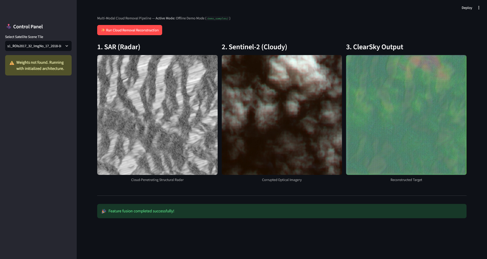
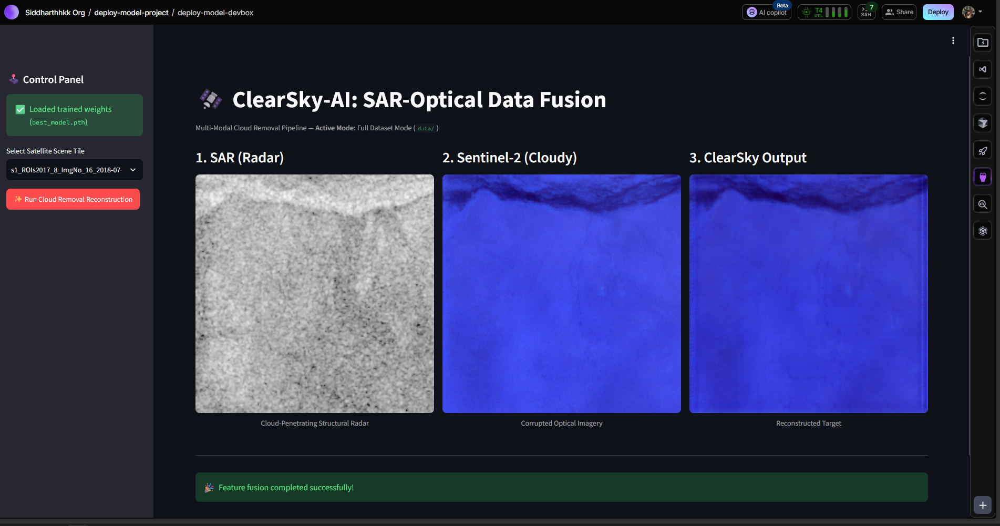
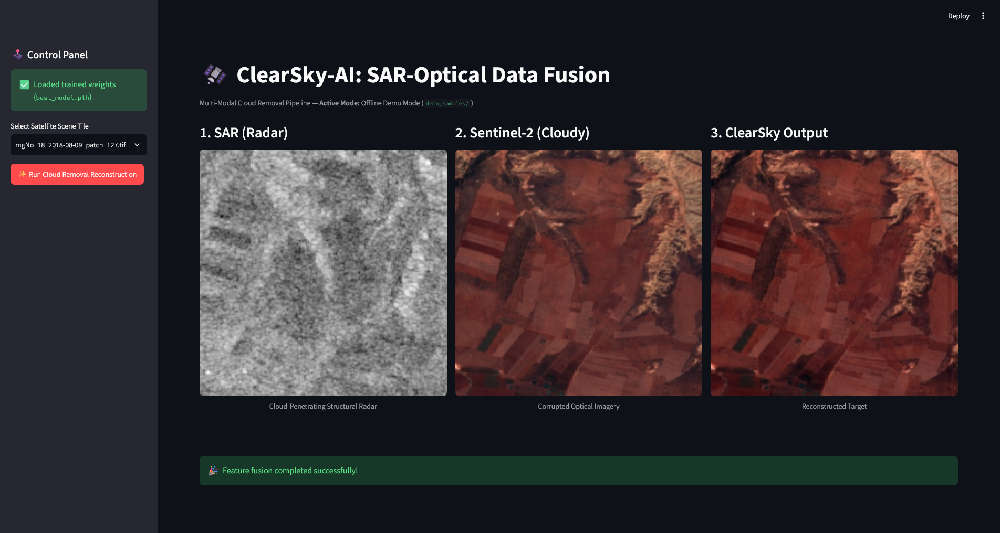

# 🛰️ ClearSky-AI — SAR-Optical Data Fusion for Cloud Removal


**ClearSky-AI** is an academic deep-learning project for reconstructing cloud-free Sentinel-2 optical imagery by combining cloudy optical observations with cloud-penetrating Sentinel-1 SAR information.

The project did not arrive at its current training pipeline in one step. It began as a dual-stream U-Net experiment, then went through model training, visual debugging, data-pipeline fixes, loss-function changes, and finally a more controlled validation and evaluation protocol.

The goal of this README is to preserve that story rather than simply presenting the final code.

> **Current status:** a fresh 50-epoch training run is in progress using the corrected training pipeline. The historical 25-epoch model remains documented as the previous experiment.

---

# 📖 1. Where the Idea Started

The core idea was straightforward:

**Sentinel-2 gives us rich optical information, but clouds can hide the ground. Sentinel-1 SAR can observe surface structure even when optical imagery is obscured.**

That led to a dual-stream conditional GAN architecture:

- **SAR encoder:** 2 channels — VV and VH.
- **Optical encoder:** 4 channels — B04, B03, B02, B08 = Red, Green, Blue, NIR.
- **SCA bottleneck:** Spatial-Channel Attention for SAR/optical feature fusion.
- **U-Net decoder:** reconstructs the four-band optical output using dual skip connections.
- **70×70 PatchGAN:** judges local realism from SAR + cloudy optical + target/generated optical.

The first objective was simply to prove that the two modalities could work together.

And they could.

But the first successful model also taught us that **a working model is not automatically a clean experiment**.

---

# 🧠 2. The Architecture We Built

## Generator — ClearSkyUNet

### Encoder A — Sentinel-1 SAR

Input:

    VV + VH

This branch learns radar-derived structural and textural information that can remain available through cloud cover.

### Encoder B — Sentinel-2 Optical

Input:

    B04 + B03 + B02 + B08
    Red + Green + Blue + NIR

The optical branch provides visible and near-infrared information from the partially observed scene.

### Fusion

The deepest SAR and optical representations are concatenated and passed through the SCA bottleneck.

SCA combines:

- channel attention;
- spatial attention.

The fused representation then enters the decoder.

### Output

The generator produces:

    R + G + B + NIR

with a Tanh output, so the model works internally in the normalized range:

    [-1, 1]

---

# ⚖️ 3. Why the Loss Function Became More Sophisticated

Our early experiments relied heavily on pixel-wise L1 reconstruction.

That created a practical problem: when clouds covered a large region, simply preserving the visible cloudy structure could sometimes be a safer way to reduce pixel error than reconstructing the hidden terrain.

So the original generator objective was:

    LG = LGAN + 50 × LL1 + 10 × LVGG

Diagnostics on held-out validation/test tiles showed that cloud-obscured regions had substantially higher RGB error than visible regions. The training objective has therefore been updated to explicitly weight reconstruction inside synthetic cloud masks:

    Lcloud = MAE(prediction[cloud], target[cloud])
    Lrecon = LL1 + 2 × Lcloud

    LG = LGAN + 50 × Lrecon + 10 × LVGG

This makes cloud pixels receive 3× the base reconstruction weight while keeping the existing GAN and perceptual terms unchanged. The new objective is committed in the training code; a fresh training run is required before reporting new model results.

### GAN loss

The PatchGAN discriminator encourages locally realistic texture and structure.

### L1 loss

L1 provides the main pixel-level reconstruction constraint.

### VGG perceptual loss

RGB output is mapped back to [0,1], normalized using ImageNet statistics, and passed through the first 36 layers of pretrained VGG19.

The model therefore receives three different kinds of pressure:

    numerical accuracy
    +
    local realism
    +
    perceptual structure

This multi-loss setup became an important part of the original successful model.

---

# 🕰️ 4. The Previous Training Run

The first major full experiment trained for **25 epochs** on Lightning.ai.

Its historical peak was:

## **31.50 dB PSNR at Epoch 10**

That run produced the original trained weights stored in:

- weights/best_model.pth
- weights/latest_model.pth

These weights are **not being discarded**. They are part of the project's experimental history and remain useful as a historical baseline.

However, we are not treating the 31.50 dB number as the official result of the current pipeline.

The reason is important:

**the experiment itself has changed.**

---

# 🔍 5. What We Learned From the First Model

Several issues showed up after the first training/deployment cycle.

Some were obvious visual problems. Others were subtle methodological problems that only become visible when you ask whether the validation and test numbers can really be trusted.

The biggest lessons were:

### The image channels must mean what we think they mean

The original optical pipeline had an RGB ordering problem.

### Normalization must not depend on the current image

Clouds should not be allowed to change the scaling of the very image we are trying to reconstruct.

### Training, validation, and test data need a genuine separation

Choosing the best model based on training behavior is not enough.

### Evaluation itself needs to be reproducible

If validation images change every time we evaluate, the PSNR is harder to interpret.

### A single attractive PSNR number is not enough

We need to know which data produced it, which preprocessing was used, and how the checkpoint was selected.

That led to the current training rebuild.

---

# 🔧 6. The Training Pipeline Rebuild

## 6.1 Correct Sentinel-2 band order

The generator is designed for:

    [B04, B03, B02, B08]

which is:

    [Red, Green, Blue, NIR]

The dataset loader now explicitly reads bands:

    [4, 3, 2, 8]

This fixed both the model input semantics and the RGB visualization pipeline.

It also addresses the earlier blue-tint issue documented in the debugging report.

---

## 6.2 Fixed preprocessing instead of image-specific min-max scaling

The earlier approach used each image's own minimum and maximum.

That makes the scale of the input depend on the contents of that image, including potentially the cloud-covered regions.

The new preprocessing uses fixed ranges.

### Sentinel-1

VV:

    [-25, 0] dB

VH:

    [-32.5, 0] dB

### Sentinel-2

Optical values:

    [0, 10000]

Everything is clipped to these ranges and mapped to:

    [-1, 1]

The logic is centralized in src/preprocess.py, so training and inference share the same normalization rules.

---

## 6.3 ROI-level train / validation / test separation

The updated dataset loader separates samples by **ROI**, rather than treating every individual tile as an independent random sample.

The protocol is:

    training ROIs
        ↓
    training set

    validation ROIs
        ↓
    validation set

    official hold-out ROIs
        ↓
    test set

The validation set selects the best model.

The test set is reserved for the final hold-out evaluation.

This makes the benchmark much easier to interpret than selecting a checkpoint on the training data.

---

## 6.4 Deterministic validation and test corruption

Training clouds remain randomly generated.

Validation and test clouds are deterministic.

So when the model is evaluated at Epoch 5, Epoch 15, or Epoch 40, the evaluation conditions are reproducible.

That makes changes in validation PSNR much more meaningful.

---

## 6.5 Best model is selected using validation PSNR

The current checkpoint rule is:

    best model = epoch with highest validation PSNR

The test set is not used for checkpoint selection.

At the end of training:

    best validation model
          ↓
    load generator
          ↓
    run once on hold-out test set
          ↓
    final test PSNR

This keeps the final test measurement separate from model selection.

---

## 6.6 Dataset-level PSNR aggregation

The evaluation no longer depends on averaging a collection of batch-level dB values.

Instead, the training script accumulates:

    total squared error
    total number of evaluated elements

and computes one aggregate MSE followed by PSNR.

Because the model output is normalized to [-1, 1], the PSNR calculation uses a peak-to-peak range of 2.

This gives a single dataset-level reconstruction measurement.

---

## 6.7 Full resumable checkpoints

The latest checkpoint now stores much more than only the generator.

It contains:

- Generator state
- Discriminator state
- Generator optimizer
- Discriminator optimizer
- both AMP scaler states
- current epoch
- best validation PSNR
- seed and loss weights
- random-number-generator states

This means an interrupted experiment can resume with the training state intact.

---

## 6.8 Cleaner GAN optimization

During the generator update, discriminator parameters are temporarily frozen.

The generator still receives gradients through the discriminator, but discriminator parameter gradients are not unnecessarily accumulated during the generator step.

This reduces wasted work and makes the intended optimization flow clearer.

---

## 6.9 Mixed-precision CUDA training

CUDA automatic mixed precision is enabled when a GPU is available.

The current Lightning machine is:

    NVIDIA Tesla T4
    ~14.6 GB usable VRAM

For this experiment we are using:

    Batch size = 4

to leave reasonable memory headroom for the dual-encoder generator, PatchGAN, and VGG19 perceptual network.

---

# 🚂 7. The Current Experiment

This is the **first fresh training run using the redesigned pipeline**.

We are intentionally not resuming from the historical checkpoint.

That is not because the old weights are useless.

It is because the old weights were learned under an older preprocessing and evaluation regime. Continuing from them would mix two different experimental setups.

So the current run starts with fresh model initialization while reusing the same dataset and the same Lightning environment.

### Current configuration

| Setting | Current run |
|---|---:|
| GPU | NVIDIA Tesla T4 |
| VRAM | ~14.6 GB |
| Epochs | 50 |
| Batch size | 4 |
| Learning rate | 0.0002 |
| L1 weight | 50 |
| VGG weight | 10 |
| Seed | 42 |
| AMP | Enabled |
| Resume old checkpoint | No |
| Best-model criterion | Validation PSNR |
| Final evaluation | Hold-out test set |

The training script now also prints:

- GPU and VRAM;
- dataset indexing progress;
- train/validation/test sample counts;
- batches per epoch;
- generator and discriminator parameter counts;
- VGG loading status;
- batch progress;
- generator loss;
- discriminator loss;
- batch PSNR;
- validation PSNR;
- peak GPU memory;
- checkpoint saves.

So the experiment is visible instead of looking like a black box.

---

# 📊 8. Results — Current Run

The current 50-epoch retraining run has completed. The supplied completion log shows the final hold-out evaluation at **32.48 dB PSNR** using the best validation-selected generator. The highest validation PSNR visible in the supplied log was **37.13 dB at Epoch 48**.

| Metric | Result |
|---|---:|
| Best validation PSNR observed in completion log | **37.13 dB** (Epoch 48) |
| Final hold-out test PSNR | **32.48 dB** |
| Final training PSNR | **34.03 dB** (Epoch 50) |
| Peak PyTorch allocated GPU memory | **~0.96 GB** |
| GPU | **NVIDIA Tesla T4 (~14.6 GB usable VRAM)** |

## Epoch visual record

Epoch screenshots from the current run will be added here after training.

Suggested record:

    Epoch 1
    Epoch 5
    Epoch 10
    Epoch 20
    Epoch 30
    Epoch 40
    Epoch 50

The screenshots will be kept separate from the earlier 25-epoch experiment so the two runs are easy to distinguish.

---

# 🖼️ 9. Visual Debugging Was Part of the Research

The project did not go directly from code to a polished output.

The visual failures were useful because they pointed us toward actual data and inference problems.

## Technical report

The existing debugging and development report is available at:

**[temp/report.html](temp/report.html)**

## Green-noise stage



The early untrained application showed a noisy green-looking reconstruction. This was the pre-training UI state rather than evidence of successful cloud removal.

## Blue-tint stage



This exposed the incorrect optical-channel-to-RGB mapping.

## Corrected true-color stage



This shows the visualization after the optical channels were aligned correctly.

## Historical training run


This screenshot documents the previous 25-epoch experiment and its historical 31.50 dB peak.

> The final completion screenshot is being preserved with the technical report as `temp/training_final.png`.

---

# 🌍 10. The Biggest Limitation That Still Remains

Even after all of these fixes, there is one important limitation in the current training design:

## We are still using synthetic clouds.

The current pipeline effectively does this:

    clean Sentinel-2
          ↓
    synthetic cloud mask
          ↓
    cloudy optical input
          +
    Sentinel-1 SAR
          ↓
    ClearSkyUNet
          ↓
    reconstructed optical image
          ↓
    compare with original clean target

This is useful because it gives us a controlled experiment.

But synthetic corruption is not the same as real satellite cloud contamination.

Real observations contain:

- real cloud boundaries;
- cloud thickness variations;
- cloud shadows;
- haze and atmospheric effects;
- acquisition differences;
- seasonal changes;
- temporal land-surface changes.

So the current model should be described honestly as:

> **SAR-conditioned optical reconstruction under synthetic cloud corruption**

rather than as the final version of real-world cloud removal.

---

# 🚀 11. The Next Major Step: Use Real Cloudy / Cloud-Free Temporal Observations

This is the next major direction for the project.

The **SEN12MS-CR-TS** benchmark was created specifically for **multi-modal, multi-temporal cloud removal**. It contains Sentinel-1 and Sentinel-2 time series and cloud information, enabling a move beyond artificially masking a clean image.

The official project also provides data-loader support for cloudy/cloud-free samples and cloud masks.

References:

- [SEN12MS-CR-TS paper](https://arxiv.org/abs/2201.09613)
- [Official SEN12MS-CR-TS toolbox](https://github.com/PatrickTUM/SEN12MS-CR-TS)

## What changes in Phase 4?

Instead of:

    clean image
        ↓
    artificial cloud

we move toward:

    real cloudy Sentinel-2 observations
              +
    native cloud masks
              +
    temporally related Sentinel-1 observations
              +
    other dates from the same region
              ↓
          ClearSky-AI
              ↓
       clear reference image

The model can then learn from **actual cloud patterns and actual temporal observations**, instead of learning only from our synthetic corruption process.

---

# 🕒 12. Multi-Temporal ClearSky-AI

The eventual architecture can also grow from a single cloudy optical frame into a temporal model.

Instead of feeding one observation:

    S1 + cloudy S2

we can provide several observations of the same region:

    S2 at t1
    S2 at t2
    S2 at t3
    ...
    +
    SAR observations
    +
    cloud masks

The network can then learn:

> which dates contain useful information for reconstructing the regions hidden at another date.

That is the key idea behind moving from a simple image-to-image reconstruction system toward a more realistic multi-temporal cloud-removal system.

---

## ☁️ Real-cloud DSen2-CR quick test

To test the pretrained DSen2-CR model on genuine cloudy/cloud-free SEN12MS-CR pairs without downloading the full dataset, use the streaming helper:

    pip install -r requirements.txt
    python scripts/download_real_cloud_demo.py --samples 5 --seed 42

The helper streams the public `Hermanni/sen12mscr` mirror instead of downloading the full dataset. The mirror contains paired Sentinel-1, cloudy Sentinel-2, and cloud-free Sentinel-2 patches and is released under CC BY 4.0. Hugging Face documents `streaming=True` for accessing large datasets without downloading them locally.

The generated `real_cloud_demo/` directory is ignored by Git. These samples are intended for local inference/debugging, not as a replacement for the official DSen2-CR test protocol.

# 🧠 12.5 Pretrained DSen2-CR Baseline

Because a new full training run is currently unavailable, ClearSky-AI also supports the public DSen2-CR SAR-optical cloud-removal model as an external pretrained baseline.

DSen2-CR was developed specifically for Sentinel-2 cloud removal using Sentinel-1 SAR guidance. The published architecture takes 13 Sentinel-2 bands plus 2 SAR channels and reconstructs all 13 optical bands. The original authors provide a pretrained checkpoint trained with the CARL loss.

In ClearSky-AI, the external Keras HDF5 checkpoint is converted into a PyTorch state dictionary and exposed as a separate model backend in the Streamlit app.

The two models are kept conceptually separate:

    ClearSkyUNet
        ↓
    our custom architecture + weights

    DSen2-CR
        ↓
    published architecture + published pretrained weights

The DSen2-CR backend is an inference baseline. It does not replace the ClearSkyUNet model or its experimental results.

# 🔬 13. Further Research Directions

Once the current baseline is established, several improvements become possible.

### Cloud-aware losses

This is now implemented in the training pipeline. Each synthetic cloud mask is returned by the dataset and used to add an explicit masked reconstruction term. The default cloud weight is lambda_cloud=2.0.

Future work can make this more realistic by deriving masks from real cloudy Sentinel-2 observations instead of synthetic corruption.

### Spectral consistency

The current VGG loss focuses on RGB.

A future version can add an explicit spectral reconstruction constraint for NIR and potentially additional Sentinel-2 bands.

### Stronger temporal fusion

Multiple dates could be fused with temporal attention, recurrent processing, transformers, or other sequence models.

### Ablation studies

We can separately measure what happens when we remove:

- SAR;
- SCA;
- VGG;
- GAN loss;
- temporal information.

That would tell us which pieces of the architecture actually contribute to the reconstruction.

### Uncertainty estimation

For heavily clouded regions, the correct answer may not be uniquely determined from the available observations.

A future system could therefore estimate uncertainty rather than presenting every reconstruction with the same level of confidence.

---

# 💾 14. Dataset Strategy

ClearSky-AI uses the SEN12MS-CR-TS dataset, which is large enough that keeping the entire dataset inside the Git repository is impractical.

The project therefore separates data and code.

### data/

The full local/cloud training dataset.

Ignored by Git.

### demo_samples/

A smaller tracked subset used for demonstration and lightweight testing.

The demo generator now samples **only from the held-out test ROIs by default**. This means the local demo can use scenes from regions that were excluded from model training and validation-based checkpoint selection.

Generate a fresh 60-pair demo set:

```bash
python scripts/create_demo_subset.py
```

Use a different random seed to get a different selection from the same held-out test ROIs:

```bash
python scripts/create_demo_subset.py --seed 123
```

Change the number of pairs:

```bash
python scripts/create_demo_subset.py --pairs 30 --seed 123
```

Sampling from all ROIs is still possible explicitly with `--all-rois`, but the default is the held-out test set.

### weights/

Model checkpoints and trained model weights.

### temp/

Technical reports, debugging figures, and experiment artifacts.

This keeps the repository lightweight while preserving the development history.

---

# 🛠️ 15. Current Project Structure

~~~text
CLEARSKKYAI/
├── app/
│   └── main.py
│
├── data/                  # ignored: full training dataset
├── demo_samples/          # tracked: demo subset
│
├── scripts/
│   ├── create_demo_subset.py
│   ├── download_sample.py
│   └── extract_sample.py
│
├── src/
│   ├── dataset.py         # ROI split + loading + cloud generation
│   ├── models.py          # ClearSkyUNet + PatchGAN
│   ├── preprocess.py      # shared fixed-range preprocessing
│   └── train.py           # training / validation / test
│
├── temp/
│   ├── report.html
│   ├── figure2.png
│   ├── figure3.png
│   ├── figure4.png
│   └── epoch*.png         # current-run screenshots added later
│
├── weights/
│   ├── best_model.pth
│   └── latest_model.pth
│
├── requirements.txt
└── readme.md
~~~

---

# ⚙️ 16. Reproducibility

Install dependencies:

~~~bash
pip install -r requirements.txt
~~~

Current training command:

~~~bash
python -c "import sys; sys.path.insert(0, 'src'); from train import train_model; train_model(data_dir='data/', epochs=50, batch_size=4, lr=0.0002, lambda_l1=50.0, lambda_vgg=10.0, seed=42, resume=False)"
~~~

The script automatically selects CUDA when available.

For the current Lightning T4 experiment, batch size 4 is used to stay within the available GPU memory.

---

# 🎯 17. Where ClearSky-AI Stands Now

The project has moved through three clear stages:

    Prototype
       ↓
    Debugged system
       ↓
    Controlled training experiment

The first trained weights remain important because they show where the project started.

The current experiment is intended to become the cleaner baseline because it uses:

- correct Sentinel-2 band ordering;
- shared fixed preprocessing;
- ROI-level validation and testing;
- deterministic validation/test corruption;
- validation-based checkpoint selection;
- aggregate dataset-level PSNR;
- resumable checkpoints;
- mixed-precision CUDA training;
- cleaner GAN optimization;
- explicit experiment configuration and progress logging.

The next major improvement is therefore **not simply "train for more epochs."**

It is:

> **Move from synthetic cloud corruption toward real cloudy observations, native cloud masks, and multi-temporal Sentinel-1/Sentinel-2 information.**

That is the path from a working SAR-guided reconstruction model toward a more realistic research system for satellite cloud removal.

---

# 📚 References

Ebel, P., Xu, Y., Schmitt, M., & Zhu, X. X. (2022).

**SEN12MS-CR-TS: A Remote Sensing Data Set for Multi-modal Multi-temporal Cloud Removal.**

- [Paper — arXiv](https://arxiv.org/abs/2201.09613)
- [Official SEN12MS-CR-TS repository](https://github.com/PatrickTUM/SEN12MS-CR-TS)
