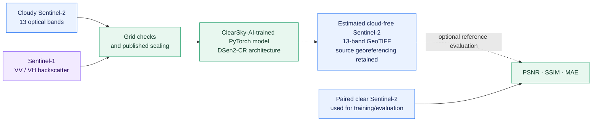

<div align="center">

# ☁️ ClearSky-AI

### SAR-guided reconstruction for cloudy Sentinel-2 imagery

**Sentinel-1 VV/VH · 13-band Sentinel-2 · PyTorch · Streamlit**

[](#quick-start)
[](#model-flow)
[](#quick-start)
[](LICENSE)

*Reconstructing cloud-obscured optical imagery with radar guidance.*

</div>

---

ClearSky-AI is a remote-sensing research project. Its main demo takes a cloudy
Sentinel-2 image and a co-registered Sentinel-1 radar image, then estimates the
cloud-free Sentinel-2 surface. It also preserves a separate, experimental
LISS-IV research workflow.

> **Model provenance:** `weights/clearskkyai.pth` is the ClearSky-AI-trained
> Sentinel checkpoint. Its PyTorch network follows the DSen2-CR architecture
> described by Meraner et al. (2020). Reconstructions are estimates and can be
> wrong where clouds hide the ground.

## Explore

[Quick start](#quick-start) · [Model flow](#model-flow) ·
[Demo results](#demo-results) · [Training](#training) ·
[LISS-IV research](#liss-iv-research-track) ·
[Limitations](#limitations) · [LISS-IV folder guide](liss4/README.md) ·
[Full technical guide](PROJECT_GUIDE.md)

## Model flow

The input rasters must already share the same CRS, pixel grid, and affine
transform. The model returns a 13-band estimate on the optical image's grid.


```mermaid
flowchart LR
    S2["Cloudy Sentinel-2<br/>13 optical bands"] --> GRID["Grid checks<br/>and published scaling"]
    S1["Sentinel-1<br/>VV / VH backscatter"] --> GRID
    GRID --> MODEL["ClearSky-AI-trained PyTorch model<br/>DSen2-CR architecture"]
    MODEL --> OUT["Estimated cloud-free Sentinel-2<br/>13-band GeoTIFF<br/>source georeferencing retained"]
    OUT -. "optional reference evaluation" .-> METRICS["PSNR · SSIM · MAE"]
    REF["Paired clear Sentinel-2<br/>used for training/evaluation"] --> METRICS

    classDef optical fill:#eaf2ff,stroke:#3b82f6,color:#172554
    classDef radar fill:#f2eaff,stroke:#8b5cf6,color:#2e1065
    classDef process fill:#e8f7ef,stroke:#22a06b,color:#123b2a
    class S2,OUT,REF optical
    class S1 radar
    class GRID,MODEL,METRICS process
```

## Demo results

The expanded gallery run covered **964 held-out patches** from the prepared
SEN12MS-CR subset:

| Measure | Cloudy input | Reconstruction |
| --- | ---: | ---: |
| Mean per-patch PSNR | 17.25 dB | 27.65 dB |
| Patches with higher PSNR after reconstruction | — | 960 / 964 |

These are patch-level results from one dataset, not a benchmark or independent
external validation. Clear references can come from a different acquisition
date. See the
[detailed evaluation notes](PROJECT_GUIDE.md#prepare-demo-examples-and-the-expanded-local-subset).

## Quick start

The sample gallery and ClearSky-AI-trained checkpoint use Git LFS. Install Git LFS before
cloning so the repository downloads the actual images and weights.

```powershell
git lfs install
git clone https://github.com/siddharthhkk/CLEARSKKYAI.git
cd CLEARSKKYAI
git lfs pull
python -m pip install -r requirements.txt
streamlit run app.py
```

In the app, choose a paired gallery sample or provide local files. The optical
input uses the 13 bands `B01, B02, B03, B04, B05, B06, B07, B08, B8A, B09,
B10, B11, B12`. The radar input is a two-band Sentinel-1 GeoTIFF in `VV, VH`
order with values in dB. Both rasters must use the same pixel grid.


## What is included

| Component | What it does |
| --- | --- |
| Sentinel-1/2 demo | Streamlit interface for 1,060 paired gallery samples, local paths, or uploads |
| Tiled Sentinel inference | Writes a georeferenced 13-band reconstruction GeoTIFF |
| PyTorch training workflow | Trains on paired SEN12MS-CR records when the source dataset is available |
| Evaluation gallery | Browses cloudy input, estimate, clear reference, and per-patch metrics |
| LISS-IV research track | Separate [three-band interface, source, scripts, and guide](liss4/README.md) |

## Training

The Sentinel training command uses SEN12MS-CR triplets. Download the dataset
and its `datasetfilelist.csv` from the [official dataset record](https://mediatum.ub.tum.de/1554803),
then run this from the repository root in PowerShell:

```powershell
python train.py `
  --manifest path\to\datasetfilelist.csv `
  --data-root path\to\SEN12MS-CR `
  --output weights\dsen2cr_sar_carl_trained.pth `
  --epochs 8 --batch-size 1 --crop-size 128 --device auto
```

The training workflow uses the dataset's train and validation splits and
excludes its listed test split. It saves the best validation checkpoint, a
resumable checkpoint, and an epoch history. Training is optional when using the
bundled ClearSky-AI-trained checkpoint, which is included through Git LFS. See the
[full training guide](PROJECT_GUIDE.md#train-the-pytorch-sentinel-model) for
data preparation and resume options.

## LISS-IV research track

The LISS-IV app and experiments are a separate, optical-only track under
`liss4/src/` and `liss4/scripts/`. They use `[Green, Red, NIR]` bands
(typically `BAND2`, `BAND3`, `BAND4`) and do not use
Sentinel-1 SAR. The bundled LISS-IV checkpoint was trained with synthetic cloud
corruption; its real-scene comparison uses a temporal reference and is not
same-time ground truth.

Paired LISS-IV fine-tuning code is available, including an optional DiffCR
initialization. It needs co-registered cloudy/clear LISS-IV pairs. The current
[`data/liss4_pairs/manifest.csv`](data/liss4_pairs/manifest.csv) is an empty
template because this checkout has no verified native cloudy/clear pair set.
AllClear pretraining is not currently part of the workflow. A future
cross-sensor pretraining stage should use AllClear's training split, then be
fine-tuned and evaluated separately on LISS-IV data.

See the [LISS-IV experiment history](PROJECT_GUIDE.md#historical-liss-iv-model-and-evidence),
[paired training setup](PROJECT_GUIDE.md#train-on-paired-cloudyclear-liss-iv-imagery),
and [DiffCR fine-tuning notes](PROJECT_GUIDE.md#fine-tune-the-linked-repos-pretrained-diffcr-model).

## Roadmap

- Evaluate on more geographically independent scenes with reliable cloud masks
  and carefully aligned clear references.
- Explore AllClear training-split pretraining followed by sensor-specific
  fine-tuning when the dataset and compute are available.
- Expand LISS-IV training with verified native pairs; additional compute would
  support larger scenes, more experiments, and broader validation.

## Limitations

- Cloud-obscured surface detail is not directly observed; the model may invent
  or miss features, especially under thick cloud or outside its training domain.
- The gallery comes from one dataset. Held-out patches within it do not prove
  performance on other sensors, regions, or seasons.
- Reference images may be from different acquisition dates, so metric scores
  include temporal and registration differences.
- LISS-IV results are experimental, and the current paired-training manifest
  has no verified pairs.

## Research and license

- [SEN12MS-CR dataset record](https://mediatum.ub.tum.de/1554803)
- [AllClear dataset and benchmark](https://github.com/Zhou-Hangyu/allclear)
- [DiffCR source repository](https://github.com/Zhou-Hangyu/DiffCR)

ClearSky-AI is distributed under the [GNU GPL-3.0 license](LICENSE).

---

<div align="center">

**Want the implementation details?** Start with the
[full project guide](PROJECT_GUIDE.md) for data preparation, training,
inference, experiments, and repository layout.

</div>
